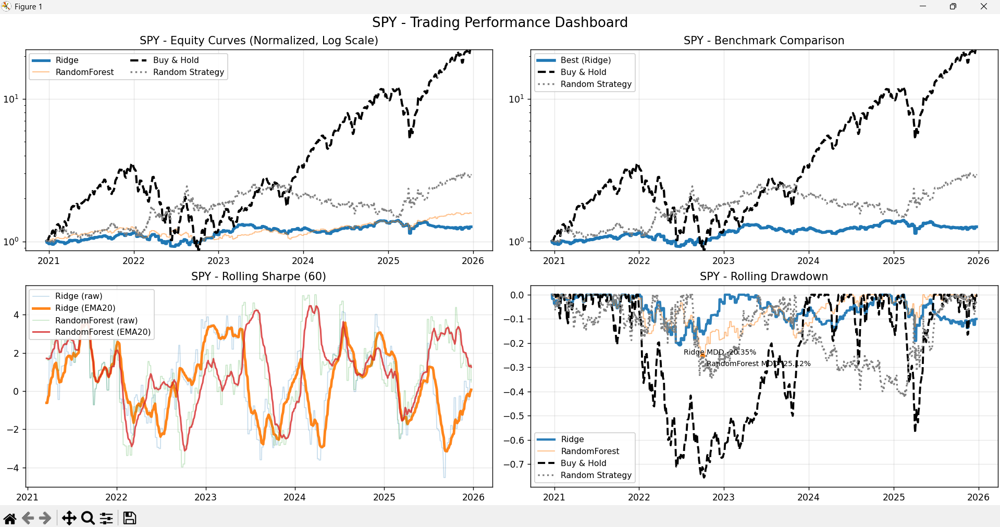
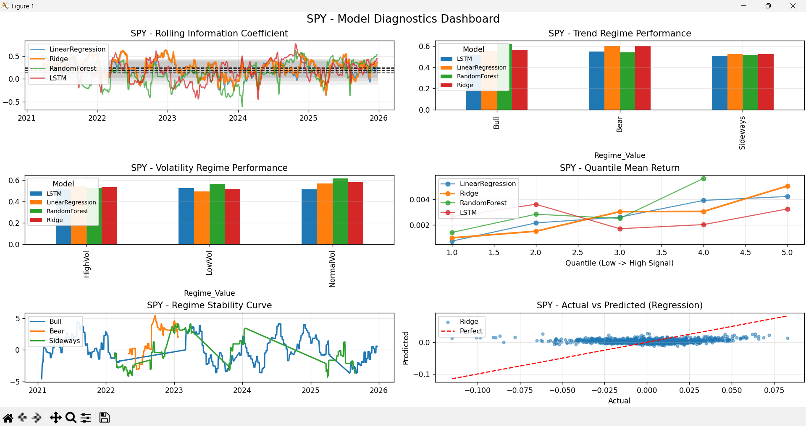

# Regime-Sensitive Performance Analysis of Machine Learning Models for Stock Prediction

A CLI-based quantitative research framework designed to evaluate how different
machine learning models perform across varying market regimes. The project
emphasizes robustness, stability, and real-world trading performance rather than
just predictive accuracy.

---

## Overview

This project analyzes stock return prediction using multiple machine learning
models and evaluates their behavior under different market conditions such as
trend and volatility regimes.

The framework integrates:

- Data ingestion from external APIs
- Feature engineering for financial time series
- Regime classification (trend and volatility)
- Walk-forward validation
- Trading strategy simulation
- Performance evaluation using both statistical and financial metrics

---

## Models Implemented

- Linear Regression
- Ridge Regression
- Random Forest
- Long Short-Term Memory (LSTM)

---

## Key Features

- Regime-aware performance analysis
- Walk-forward (time-series safe) validation
- Backtesting with transaction costs
- Long/Short trading simulation
- Composite scoring and model ranking
- Experiment tracking and result storage

---

## Market Regime Framework

Market conditions are classified based on:

- **Trend Regime**\
  Derived using moving average relationships (e.g., short-term vs long-term)

- **Volatility Regime**\
  Based on rolling standard deviation of returns

- **Crash Detection**\
  Extreme negative returns flagged as crash events

---

## Evaluation Metrics

Models are evaluated using both prediction and trading metrics:

- RMSE (Root Mean Squared Error)
- Directional Accuracy
- Sharpe Ratio
- Information Coefficient (IC)
- Cumulative Returns
- Regime Dispersion

---

## Project Structure

```text
project/
├── main.py
├── config.py
├── requirements.txt
├── README.md
│
├── data/
│   ├── loader.py
│   ├── sources/
│   ├── datasets/
│
├── features/
├── regimes/
├── models/
├── evaluation/
├── backtesting/
├── experiments/
├── utils/
```

---

## Installation

Install dependencies:

```bash
pip install -r requirements.txt
```
## Usage

Run the CLI with default full analysis:

```bash
python main.py \
  --ticker SPY \
  --start 2000-01-01 \
  --end 2026-01-01 \
  --model all \
  --data_mode tiingo \
  --save_results \
  --analysis_mode auto \
  --advanced_analysis
````

---

## Key CLI Arguments

| Argument              | Description                                                |
| --------------------- | ---------------------------------------------------------- |
| `--ticker`            | Stock symbol (e.g., SPY, AAPL)                             |
| `--start`, `--end`    | Date range for analysis                                    |
| `--model`             | Model selection: `linear`, `ridge`, `rf`, `lstm`, or `all` |
| `--data_mode`         | `tiingo`, `local`, or `synthetic`                          |
| `--analysis_mode`     | `auto` or `custom`                                         |
| `--advanced_analysis` | Enables extended diagnostics                               |
| `--save_results`      | Saves outputs to disk                                      |

---


## Methodology Overview

The pipeline begins with historical price data ingestion followed by preprocessing and feature engineering. Market regimes are defined using trend and volatility indicators. Models are trained using time-series-aware validation, and predictions are converted into trading signals. A backtesting engine simulates trading performance, and results are evaluated using both statistical and financial metrics.

---

## Key Results

| Model             | RMSE   | Sharpe | Directional Accuracy |
| ----------------- | ------ | ------ | -------------------- |
| Ridge             | 0.0227 | 0.29   | 56.0%                |
| Linear Regression | 0.0227 | 0.25   | 55.2%                |
| Random Forest     | 0.0224 | 0.58   | 58.9%                |
| LSTM              | 0.0476 | -0.10  | 51.5%                |

## Insight

Despite moderate predictive accuracy, no model outperformed a random strategy on
a risk-adjusted basis, supporting weak-form market efficiency.

---

## Output Files

| Path                                  | Description        |
| ------------------------------------- | ------------------ |
| `experiments/results/`                | Per-run results    |
| `experiments/summary/leaderboard.csv` | Model rankings     |
| `experiments/metadata/run_log.json`   | Run logs           |
| `data/datasets/versions/`             | Versioned datasets |

---

## Sample Results




---

## Research Paper

Full report available here: [View Paper](docs/paper.pdf)

---

## Future Improvements

Potential improvements include incorporating macroeconomic and sentiment-based
features, exploring ensemble learning approaches, using higher-frequency data,
and refining regime detection methods.

---

## License

This project is intended for academic and research purposes only.
